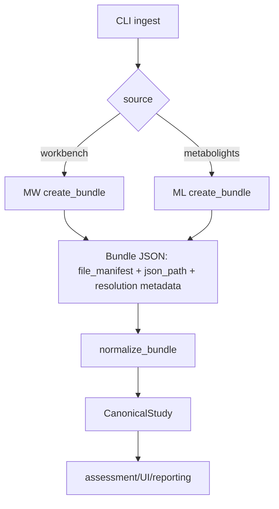
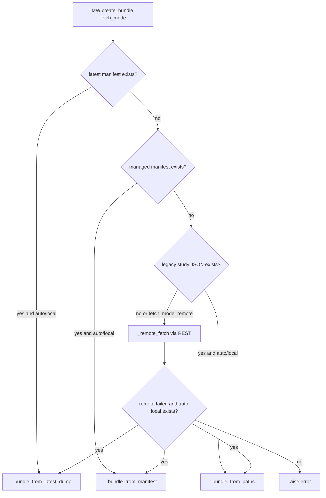
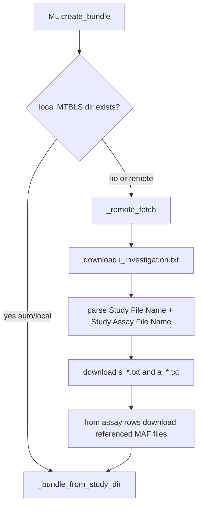

# MERIT Data Ingestion Workflow (Metabolomics Workbench + MetaboLights)

This document is a code-accurate workflow map of the current MERIT ingestion stack, with emphasis on:
- endpoint usage,
- local dump directory contracts,
- disease and metabolite extraction for MW,
- mz/RT and non-metabolite feature pattern handling for MW,
- and how parsed data flows into canonical objects used by assessment/UI.

## 1) Entry Points and Runtime Modes

Main CLI entry:
- `python3 -m merit ingest --study-id <ID> --fetch-mode auto|local|remote --root <path>`
- `--source` remains supported, but runtime now defaults to Workbench.

Connector API contract:
- `RepositoryConnector.create_bundle(...)`
- `RepositoryConnector.normalize_bundle(...)`

Code anchors:
- `merit/connectors/base.py`
- `merit/connectors/__init__.py`
- `merit/cli.py`

Current runtime default:
- MERIT is now in MW-first mode by default.
- MetaboLights connector is not deleted, but disabled unless `MERIT_ENABLE_METABOLIGHTS=1` is set.

## 2) Endpoint Map

### 2.1 Metabolomics Workbench (MW)

Study-level endpoints:
- `https://www.metabolomicsworkbench.org/rest/study/study_id/{ST}/summary`
- `https://www.metabolomicsworkbench.org/rest/study/study_id/{ST}/disease`
- `https://www.metabolomicsworkbench.org/rest/study/study_id/{ST}/factors`
- `https://www.metabolomicsworkbench.org/rest/study/study_id/{ST}/analysis`
- `https://www.metabolomicsworkbench.org/rest/study/study_id/{ST}/metabolites`

Analysis-level endpoints:
- `https://www.metabolomicsworkbench.org/rest/study/analysis_id/{AN}/datatable/file`
- `https://www.metabolomicsworkbench.org/rest/study/analysis_id/{AN}/mwtab/txt`

HTML fallback for `_Results.txt` discovery:
- `https://www.metabolomicsworkbench.org/data/DRCCStudySummary.php?Mode=SetupRawDataDownload&StudyID={ST}`
- if found in page HTML: `https://www.metabolomicsworkbench.org/studydownload/{ST}_{AN}_Results.txt`

### 2.2 MetaboLights (ML)

Base endpoint:
- `https://www.ebi.ac.uk/metabolights/ws/studies/{MTBLS}/{filename}`

Downloaded core files:
- `i_Investigation.txt`
- `s_*.txt`
- `a_*.txt`
- referenced MAF files from assay rows: `m_*maf.tsv`

## 3) Directory Contracts

### 3.1 MW latest dump layout (primary local source now)

Expected layout:

```text
mw-dump-latest/
  ST00XXXX/
    manifest.json
    disease.json                  # cached study disease payload (if available)
    factors.json                  # cached sample-level factors payload (class labels + sample source)
    metabolites.json              # cached study metabolite payload (always materialized; [] if none)
    __merit_combined.json         # generated merged study payload for ingestion
    AN00YYYY/
      json/
        AN00YYYY_mwtab.json
        AN00YYYY_mwtab.txt
      tabular/
        AN00YYYY_datatable.tsv | {ST}_{AN}_Results.txt | ...
```

### 3.2 MW managed archive layout (`mw sync/pull`)

```text
<root>/
  catalog.sqlite
  objects/
    json/
    tabular/
  studies/
    ST00XXXX/
      manifest.json
  logs/
  snapshots/
```

### 3.3 MW legacy dump layout (fallback)

```text
mw-dump/ or mw_dump/
  json/ST00XXXX.json
  datatable/ST00XXXX/*
  mwtab/*
```

### 3.4 MetaboLights local layout

```text
metabolights-dump-latest/data-dump/
  MTBLSXXXX/
    i_Investigation.txt
    s_*.txt
    a_*.txt
    m_*maf.tsv
```

## 4) High-Level Workflow Plot



## 5) MW Ingestion Workflow (Detailed)

### 5.1 `create_bundle` decision tree



### 5.2 Latest-dump tabular selection logic

Per analysis from `manifest.json`, candidate order is evaluated with file priority:
1. `_Results.txt` (`results`)
2. `*_datatable.tsv*` (`datatable`)
3. `*.mwtab*` (`mwtab`)

Selection behavior:
- Choose first candidate by priority, but scan candidates and promote any candidate that has usable feature columns (`>2` columns after parsing).
- Compute per-analysis feature count (`n_metabolites`) from selected table when possible.
- Persist resolution metadata in bundle (`tabular_resolution`) for transparency/UI.

### 5.3 Disease/factors/metabolite extraction and caching for MW latest dump

```mermaid
flowchart TD
    A[ST study in mw-dump-latest] --> B{disease.json exists?}
    B -->|yes| C[load cache]
    B -->|no| D{allow remote disease fetch?}
    D -->|yes| E[GET /study_id/ST/disease]
    E --> F[write ST/disease.json]
    D -->|no| G[use empty {}]

    A --> S{factors.json exists?}
    S -->|yes| T[load cache]
    S -->|no| U{allow remote factors fetch?}
    U -->|yes| V[GET /study_id/ST/factors]
    V --> W{rows found?}
    W -->|yes| X[write ST/factors.json]
    W -->|no| Y[legacy or mwtab fallback]
    U -->|no| Y
    Y --> Z{rows found?}
    Z -->|yes| X
    Z -->|no| ZA[write ST/factors.json as []]

    A --> H{metabolites.json exists?}
    H -->|yes| I[load cache]
    H -->|no| J{allow remote metabolites fetch?}
    J -->|yes| K[GET /study_id/ST/metabolites]
    K --> L{rows found?}
    L -->|yes| M[write ST/metabolites.json]
    L -->|no| N[legacy fallback]
    J -->|no| N

    N --> O{legacy mw-dump/json/ST.json has metabolites?}
    O -->|yes| M
    O -->|no| P[fallback parse local AN*_mwtab.json blocks + top-level Data]
    P --> Q{rows found?}
    Q -->|yes| M
    Q -->|no| R[write ST/metabolites.json as []]
```

Notes:
- `factors.json` is now first-class input for class labels and sample source (`sample_type`) in normalization/UI.
- Canonical `factors.json` row shape is normalized to:
  - `local_sample_id`
  - `sample_source`
  - `factors` (pipe-delimited `Key:Value` string)
  - `mb_sample_id`
  - `raw_data`
- `factors.json` is always materialized now (real rows or `[]`) for deterministic structure.
- `metabolites.json` is always materialized now (real rows or `[]`) for deterministic structure.
- `_fallback_metabolites_rows_from_latest_dump` extracts names from `MS_METABOLITE_DATA`, `NMR_METABOLITE_DATA`, `NMR_BINNED_DATA`, `DIRECT_INFUSION_METABOLITE_DATA`, `METABOLITE_DATA`, and legacy top-level `Data`.

### 5.4 MW remote fetch mode behavior

When remote mode is used, MERIT pulls:
- study summary/disease/factors/analysis/metabolites,
- per-analysis datatable,
- and `_Results.txt` fallback if datatable has no usable features.

Generated local payload:
- `<root>/json/{ST}.json` with merged sections (`summary`, `disease`, `factors`, `analyses`, `metabolites`, `n_metabolites`).

### 5.5 MW normalization into canonical schema

Key steps:
- Parse factors into sample metadata lookup.
- Select one primary factor key for class labels using a deterministic heuristic:
  - prefer biologically meaningful keys (`Group`, `Diagnosis`, `Disease`, `Condition`, `Phenotype`, `Class`, `Status`, etc.),
  - deprioritize demographic/technical keys (`Age`, `Sex`, `Gender`, `BMI`, `Batch`, `Run`, `Injection`, etc.),
  - require label diversity (`>=2` distinct non-unknown values) before considering coverage.
- Resolve labels from `factors.json` first, then only fallback to tabular class strings when endpoint factors are missing.
- Parse tabular formats:
  - row-oriented `_Results.txt` and mwtab sections are converted to samples x features,
  - transposed matrices are pivoted.
- Remove artifact pseudo-sample rows (for header-like rows such as `Sample name` / `classification`).
- Use `sample_source` from `factors.json` as canonical `sample_type` and `organism_part` in `SampleRecord`.
- Build `StudyRecord`, `SampleRecord`, `AssayRecord`, `FeatureMatrix`.
- Build annotations and mappings using:
  - `payload.metabolites` (per-analysis first, then global match),
  - RefMet details when available,
  - fallback lexical mapping when not.
- Compute per-assay chemical class distribution (`super_class`) from metabolite endpoint payload, fallback to `refmet_by_name_dict.json.gz` if present.
- Persist raw tabular class strings in sample attributes (`class_string`) for downstream overview counts, while keeping canonical sample labels factor-aware for ML tasks.

### 5.6 Labeling Example (ST001171)

- `factors.json` contains both `Age Group` and `Group` keys.
- Canonical sample labels continue to use factor-aware endpoint parsing for ML metrics.
- Overview class pills/counts are now intentionally computed from raw tabular `Class` strings, so this study surfaces combined labels such as `Age Group:[40-50) yrs | Group:Control`.
- `sample_source` remains `Blood (serum)` and is propagated to `sample_type`/`organism_part`.

### 5.7 MW design decisions and code edits added on 2026-03-10

Scope:
- The items below are all MW-specific design decisions and code edits added today to stabilize local-dump ingestion, annotation quality accounting, and UI consistency.

Factor/context propagation:
- Added ingestion-summary fields derived from per-sample `factor_string`:
  - `factor_variables`
  - `factor_examples`
- UI overview now renders factor context from those summary fields (`Factor Variables`, `Factor Examples`).
- Redundancy removed: single `Factor Example` row was dropped; `Factor Examples` kept as the only example row.

Class label source policy (overview):
- Canonical ML labels remain factor-aware (endpoint-first fallback strategy in normalization).
- Overview class counts now prefer raw tabular class strings (`class_string` from `Class`/`Factors` rows), with fallback to parsed label only when raw class string is unavailable.
- This change was made to match repository-deposited tabular truth and avoid losing compound factor context.
- `n_classes` in summary is now computed from full class counter cardinality (not the truncated top-20 display dict).

Tabular class persistence:
- MW normalization now always preserves tabular class context in sample attributes when available:
  - `class_string`
  - `tabular_primary_label`
  - `endpoint_label` and `endpoint_label_key` when endpoint differs from tabular.
- This guarantees the overview can recover raw class labels even when sample records already existed from factor parsing.

RefMet matching policy hardening:
- Metabolite lookup now uses alias-based matching from `metabolite_name` and `refmet_name` and ranks competing rows by metadata richness.
- Workbench strict evidence policy:
  - RefMet enrichment from `refmet_by_name_dict.json.gz` fallback is disabled for Workbench annotation and class-distribution rendering.
  - Only explicit `metabolites.json` RefMet evidence is accepted (`refmet_name`, `refmet_details`, `refmet_match_count`).
- Per-analysis `super_class` derivation now uses only:
  - `metabolites.json refmet_details.super_class` when present,
  - otherwise `Unclassified` (no dictionary fallback).

mz/RT and non-metabolite pattern classification:
- Added shared feature classifier module: `merit/feature_names.py`.
- New behaviors:
  - canonical mz/RT parsing (`canonical_mzrt`)
  - mz/RT lookup key generation (`mzrt_lookup_key`)
  - feature kind classification (`classify_feature_name`) for:
    - named metabolite
    - mz/RT token
    - nmr bin
    - generic feature-id/artifact tokens
    - unknown/empty
- MW normalization now applies classifier output to every feature:
  - mz/RT features are flagged with `mz_rt_feature`
  - non-metabolite tokens are flagged with `non_metabolite_feature`
  - mapping namespace set accordingly (`mzrt_feature`, `non_metabolite_feature`, `refmet`, `lexical`)
  - mapping confidence is down-weighted for mz/RT/non-metabolite tokens unless real reference mapping exists.
- False ambiguity suppression:
  - `/` inside `m/z` tokens no longer triggers `multi_candidate_name`.

Metric policy changes (global, MW-impacting):
- `feature_annotation_type` now uses robust feature classification and reports:
  - `named`
  - `mz_rt`
  - `unannotated`
  - `non_metabolite`
- FAIR metrics were split explicitly into two non-redundant `Metadata / FAIR` checks:
  - `fair_study_metadata_compliance` (study-level FAIR metadata/provenance checks: identifier pattern, manifest/hashes, parser provenance, repository/source-root),
  - `fair_metabolite_identifier_resolvability` (feature-level FAIR: trusted namespace mapping, URI resolvability, mapping consistency, provenance readiness).
- FAIR tab naming in UI was updated to explicitly reflect both levels:
  - `Metadata / FAIR (Study + Metabolite)`.
- Metabolite FAIR scoring formula is now explicit:
  - `score = 0.45*id_coverage + 0.20*uri_coverage + 0.20*consistency + 0.15*provenance_coverage`.
- Metabolite FAIR thresholds:
  - `pass >= 0.70`, `warn 0.50-0.69`, `fail < 0.50`.
- Study-level FAIR checklist thresholds:
  - `pass >= 0.80`, `warn 0.60-0.79`, `fail < 0.60`.
- URI resolvability now includes namespace-specific URL generation, including RefMet detail URLs (`refmet_details.php?refmet_name=...`).
- Previous ontology-ratio weighting was removed from FAIR scoring; scoring now uses explicit checklist/components only.
- `identifier_coverage` was removed from `Annotation / Interoperability` to avoid duplicate scoring with FAIR metabolite resolvability.
- Backward compatibility:
  - legacy `fair_metadata_coverage` class name is retained for older serialized artifacts, while new runs use `fair_study_metadata_compliance`.

Observed validation impact on MW studies:
- `ST001171` (`metabolites.json = []`):
  - `feature_annotation_type`: `mixed_mz_rt` with `Named=0`, `mz/RT=2504`
  - `fair_metabolite_identifier_resolvability`: `0.0` (warn, no named metabolites to resolve).
- `ST003390`:
  - named annotations map strongly to RefMet; metabolite resolvability shows high pass score (`~0.927` in validation run).

Code anchors for all edits in this subsection:
- `merit/feature_names.py`
- `merit/connectors/workbench.py`
- `merit/metrics/metadata.py`
- `merit/metrics/__init__.py`
- `merit/metrics/annotation.py`
- `merit/assessment.py`
- `merit/ui.py`
- `merit/metaboscore.py`

### 5.8 MW-only Runtime Gating and UI/CLI Behavior (2026-03-11)

Backend/runtime gating:
- Connector registration now uses a runtime gate:
  - default active source: `workbench`
  - `metabolights` can be re-enabled by setting environment variable:
    - `MERIT_ENABLE_METABOLIGHTS=1`
- This is reversible; no MetaboLights connector code was removed.

CLI behavior:
- `ingest --source` now defaults to `workbench`.
- Source choices are derived from active connector registry (`available_sources()`), so disabled sources are hidden from CLI choices.

UI behavior:
- UI is now Workbench-only by default:
  - source dropdown removed from form,
  - hidden source field fixed to `workbench`,
  - workflow execution path forces `source="workbench"`,
  - copy/text updated to Workbench-focused wording.
- Fetch-mode helper is explicit:
  - Workbench: `auto` only if remote fallback is toggled;
  - otherwise local mode is enforced.

### 5.9 Analytical QC Metric/UI Refresh (MW-specific, 2026-03-11)

Analytical tab rendering model:
- Analytical QC now renders metric cards with explicit analysis-wise breakdowns for MW, instead of only one aggregate row.
- Exceptions intentionally shown as study-level only:
  - `qc_blank_presence`
  - `batch_info_availability`

Missingness semantics hardening:
- Missing is now explicitly defined as values that are empty/non-numeric after ingestion cleanup, or non-finite numeric (`NaN`/`Inf`).
- UI tooltip and metric details expose token hints treated as missing during ingestion (e.g., `""`, `NA`, `N/A`, `.`, `null`).
- `missingness_structure` and `feature_level_missingness` descriptions were rewritten to make numerator/denominator and score meaning explicit, without "parser-normalized" wording.

Missingness metric decomposition and score update:
- `missingness_structure` now computes, per analysis:
  - cell-level missingness (`missing cells / total cells`),
  - sample-level mean missingness (mean row-wise missing fraction),
  - feature-level mean missingness (mean column-wise missing fraction),
  - class-dependent missingness gap (`max class-wise missing rate - min class-wise missing rate`).
- Sample-level missingness score formula:
  - For each sample, compute: `sample_miss_rate = n_missing_features / n_features`
  - Per-analysis score: `1 − median(per-sample missingness rates)`
  - Aggregate score: `mean(per-analysis scores)`
  - Class-dependent missingness gap is reported as a separate diagnostic warning (>= 10% triggers warn status) but is not blended into the score.
- Source-aware zero handling:
  - datatable zeros are treated as valid (curated structural fill).
  - mwTab / untarg_data zeros are treated as missing (below detection).
  - Empirical basis: cell-by-cell matching of 4,464 paired mwTab/datatable analyses showed 73.9% of retained explicit mwTab missing tokens are zero-filled in datatable, with no statistical imputation.
  - All explicit nonnumeric tokens (NA, nd, bdl, bloq, <LOD, etc.) are missing in all sources.
- Rationale:
  - The sample-level metric uses the **median** because each sample is one training example; a few outlier samples (QC failures, processing errors) are routinely dropped and should not distort the score — the median represents the typical sample's completeness. The feature-level metric (`feature_level_missingness`, full profile only) uses the **mean** (score = 1 − mean of per-feature missingness rates) because every missing feature cell is a modelling gap; the mean captures total missing burden whereas a median would mask a long tail of badly incomplete features. Class-dependent missingness is a bias concern (not quantity), so it is flagged separately.

Analytical QC missingness table schema (per analysis):
- `Samples / Features` = number of biological samples (QC/blank/pool/reference excluded) and features.
- `Median sample missing %` = median of per-sample missingness rates — the typical sample's fraction of missing features. This drives the score.
- `Mean sample missing %` = mean of per-sample missingness rates (sensitive to outlier samples).
- `Class-dependent gap %` = difference between highest and lowest class-wise missingness rates.
- `Score` = 1 − median(per-sample missingness rates). Measures how complete the typical sample is.

Missingness explainability additions:
- Missingness tooltip now shows sample-level median/mean, class-dependent gap, and score formula.
- Top-10 highest-missing samples are reported in missingness tooltip and per-analysis notes.
- Top-10 highest-missing features were moved to the final `feature_level_missingness` metric block to avoid redundancy.
- A short "Column Guide" block is rendered above the missingness analysis table in UI to define each column and explain why class-dependent missingness is essential.

Normalization status updates:
- Inferred scale is now binary:
  - `raw` (score 0.0) if either raw signature rule is met;
  - `likely_transformed` (score 1.0) otherwise.
- Raw signature rules (per analysis, biological samples only):
  - strong raw: `min >= 0`, `median >= 100`, `p90 >= 1000`, `max >= 5000`;
  - sparse/wide raw-like: `min >= 0`, `max > 1000` and (`p90 > 100` or `median > 10`).
- Added `p90` and `median_to_p90_ratio` to details for interpretability.
- Added analysis-wise low-signal feature flags:
  - for each feature `f`, compute `s_f = P90(feature_f values)`;
  - threshold `T = P10({s_f across features in that analysis})`;
  - flag feature `f` if `s_f <= T`.
- Added analysis-wise near-zero-variance (NZV) diagnostics:
  - feature `f` is NZV if `Var(f) <= 1e-12` OR `Var(f)/mean(abs(f))^2 <= 1e-4`.
- NZV and low-signal are diagnostics only; they do not change the normalization score.
- UI table changes in Analytical QC (`normalization_status`):
  - includes `Declared value scale` (directly from mwTab JSON units);
  - includes `Inferred status` (`raw` vs `likely_transformed`);
  - includes low-signal and NZV counts with per-analysis top examples below the table.

Outlier burden split:
- `outlier_burden` now has two explicit components:
  - sample-level outliers (IQR rule on per-sample median abundance),
  - feature-level outlier points (IQR rule per feature across samples).
- Final score is the mean of sample-component and feature-component.
- UI now shows top outlier samples and top outlier features separately.

### 5.10 Per-Analysis Data Summary Schema/Display Extension (MW, 2026-03-11)

New per-analysis fields added end-to-end (connector -> canonical assay metadata -> ingestion summary -> UI table):
- `analysis_type` + `ms_type` displayed as one combined column:
  - `Analysis / MS Type`
- `chromatography_system` (from `CHROMATOGRAPHY.INSTRUMENT_NAME`)
- `chromatography_column` (from `CHROMATOGRAPHY.COLUMN_NAME`)
- `ms_instrument_type` (from `MS.INSTRUMENT_TYPE`, fallback NMR block when needed)
- `ms_instrument_name` (from `MS.INSTRUMENT_NAME`, fallback NMR block when needed)

UI table styling changes for wide MW studies:
- extended horizontal table with fixed minimum width for readability,
- improved header and row typography for multi-column analytical metadata.

Analysis ID formatting normalization:
- UI now normalizes analysis IDs to uppercase `AN...` everywhere (overview pills, tables, charts, tooltips, outlier lists).

### 5.11 Canonical Feature ID Convention (MW backend behavior)

Feature IDs in canonical objects are internal stable IDs generated by MERIT:
- format: `{assay_id}::f{index}` (e.g., `AN005559::f6`)
- purpose: deterministic, collision-safe internal reference across matrices and annotations.

Important distinction:
- original deposited feature/metabolite text remains preserved as annotation `raw_name`,
- canonical `feature_id` is not the same as deposited metabolite string.

### 5.12 Cohort/Bias Metadata Coverage Update (MW, 2026-03-11)

New cohort covariate metadata metric:
- Added `cohort covariate coverage (age/sex)` (internal key: `age_biological_sex_metadata`) under `Cohort / Bias`.
- Purpose:
  - quantify sample-level coverage of key cohort covariates needed for bias/confounding analysis.
- Inputs:
  - structured sample attributes + `factor_string` key:value pairs.
- Coverage definition (biological samples only; QC/blank/reference excluded):
  - `age_coverage = samples_with_present_age / n_biological_samples`
  - `sex_coverage = samples_with_present_biological_sex / n_biological_samples`
  - `score = (age_coverage + sex_coverage) / 2`
- Threshold:
  - `pass >= 0.80`, else `warn`.

Sex-distribution scoring correction:
- `biological_sex_distribution` previously returned a neutral `0.5` when sex metadata was absent.
- This was changed to `0.0` with `warn` when no binary biological-sex metadata is found.
- Rationale:
  - absence of sex metadata is now explicitly penalized in cohort-bias scoring rather than treated as neutral.
- Current cohort policy:
  - standalone `biological_sex_distribution` is removed from active metric registry to avoid duplication with `cohort covariate coverage (age/sex)`.

Leakage-check alignment fix (MW sample IDs):
- Canonical sample-ID resolution now preserves the exact tabular sample ID when that ID already exists in `factor_lookup`.
- This prevents alias-collapsing IDs like `Cancer_10` and `Cancer_No_10` into one canonical key.
- Result: `benchmark_split_leakage_risk` within-assay duplicate counts now align with the `Samples` row count in the per-analysis summary table.

### 5.13 Class Separability Tab and Score (MW, 2026-03-12)

New section and metric family:
- Added a dedicated report section/tab: `Class Separability`.
- Added metric: `class_separability` (family: `Class Separability`, full profile).

Scoring mechanism:
- Per analysis, compute two separability components on labeled biological samples:
  - Fisher effect-size:
    - `raw_fisher = tr(S_B) / tr(S_W + λI)`
    - `fisher_score = raw_fisher / (1 + raw_fisher)`
  - Predictive proxy:
    - repeated holdout (`repeats=3`, `test_size=0.25`) logistic-regression AUROC
    - binary AUROC for 2-class labels; macro one-vs-rest AUROC for multiclass labels
    - `predictive_separability = clip(2*(cv_auroc - 0.5), 0, 1)`
  - Composite per-analysis score:
    - `composite_score = 0.4*fisher_score + 0.6*predictive_separability`
- Study-level score is the weighted mean of per-analysis composite scores:
  - weights = `n_samples_labeled` per analysis.
- Status thresholds:
  - `pass >= 0.65`
  - `warn 0.40–0.649`
  - `fail < 0.40`

Preprocessing used before separability scoring (per analysis):
- keep only labeled samples with non-unknown class labels;
- exclude QC/blank/pool/reference/system-suitability rows;
- convert matrix to numeric and treat non-numeric/missing as NaN;
- median imputation per feature;
- remove constant features;
- z-score scaling per feature;
- cap to top-variance features (`MAX_FEATURES = 2000`) for stable runtime.

Visualization in separate tab:
- Added PCA class-overlay scatter (Plotly) with analysis selector dropdown.
- Plot uses PC1 vs PC2 from analysis-level z-scored matrix and overlays class-specific point clouds plus class centroids.
- Tab also shows per-analysis summary table:
  - composite score, Fisher score, raw Fisher, CV linear AUROC, predictive separability, labeled sample count, class count, features used, and skip reason (if any).

Compatibility/runtime notes:
- `AssessmentReport` schema now includes `class_separability`.
- Serialization loader is backward-compatible with older report JSON files that do not contain this field (auto-defaults to empty list).

### 5.14 Disease Source-of-Truth Policy (MW, 2026-03-12)

Policy change:
- Study-level disease is now extracted from `STxxxx/disease.json` only.
- Connector extraction now prioritizes only:
  - `Disease`
  - `disease`
  - `Disease Name`
  - `disease_name`
  - optional `disease_terms[]` fallback if present in cache.
- Study disease is no longer inferred from broad mwtab key scans (`Condition` / `Phenotype` / `Diagnosis`) for `StudyRecord.disease`.

Why this change:
- In MW, many `*_mwtab.json` disease-like keys are sample-level factors or class labels, not stable study-level disease context.
- Corpus check on current local dump:
  - studies with non-empty `disease.json`: `2468`
  - of those, studies with non-empty disease-like values in any mwtab JSON: `999`
  - studies where mwtab JSON has no non-empty disease-like value but `disease.json` is non-empty: `1469`
- This confirms that `disease.json` is the most reliable study-level disease source.

What was materialized:
- A global disease catalog was downloaded from:
  - `http://www.metabolomicsworkbench.org/rest/study/study_id/ST/disease`
- Saved as:
  - `outputs/mw_rest_st_disease.json`
- Fan-out was applied to local dump:
  - `mw-dump-latest/ST*/disease.json` (all study directories)
  - endpoint-populated studies: `2469`
  - empty `{}` studies (no endpoint disease row): `1652`
  - endpoint studies not present locally: `ST003117`, `ST004311`, `ST004643`, `ST004682`

Operational note:
- mwtab disease-like fields are still useful for sample-level class parsing and cohort labels.
- They are not treated as the authoritative study-level disease endpoint anymore.

## 6) MetaboLights Ingestion Workflow (Detailed)

### 6.1 `create_bundle` behavior

- If local study directory exists and mode is `auto|local`: bundle local files.
- Else if mode permits remote: fetch `i_Investigation.txt`, derive sample/assay files, then fetch referenced MAF files.



### 6.2 MetaboLights normalization

- Parse investigation table key-value rows.
- Sample labels: select `Factor Value[...]` column with highest non-empty coverage.
- Build canonical study/sample records from ISA metadata.
- For each assay file:
  - resolve corresponding MAF,
  - build feature matrix from MAF rows and assay sample list,
  - map identifiers (`database_identifier` preferred) and annotation fields (`formula`, `smiles`, `inchi`, `reliability`, `m/z`, `RT`).

Important difference vs MW:
- ML has no dedicated disease REST endpoint in this connector flow.
- Disease context is inferred from ISA fields (`Study Factor Name`, sample-level `Factor Value[Disease]`, etc.).

## 7) How MW disease/factors/metabolite data propagates to UI/assessment

From latest-dump MW flow:
- `ST/disease.json` -> merged into `__merit_combined.json` -> `StudyRecord.disease` via `_extract_disease_name`.
- `ST/factors.json` -> merged into `__merit_combined.json` -> sample labels + `sample_type`/matrix in canonical samples.
- `ST/metabolites.json` -> merged into `__merit_combined.json` -> per-feature annotation/mapping and per-assay class distribution.
- Raw tabular class strings (`Class`/`Factors`) -> sample `attributes.class_string` -> ingestion summary class counts -> overview class label pills.
- mz/RT and non-metabolite pattern flags from feature parsing -> annotation ambiguity flags + strict coverage metrics.
- `Metadata / FAIR (Study + Metabolite)` rendering:
  - study FAIR metric shows checklist-level pass/fail sub-checks in tooltip,
  - metabolite FAIR metric shows component-level percentages (`id_coverage`, `uri_coverage`, `consistency`, `provenance_coverage`) in tooltip.

This means both caches are first-class ingestion inputs, not only auxiliary files.

## 8) Operational Commands (Current)

Create bundle from local latest dump:
- `python3 -m merit ingest --source workbench --study-id ST001814 --fetch-mode local --root /home/shayantan/metabolomics/ML-ready/mw-dump-latest`

Backfill metabolites cache for all studies in latest dump:
- `python3 -m merit mw backfill-metabolites --root /home/shayantan/metabolomics/ML-ready/mw-dump-latest --force --verbose`

Backfill factors cache for all studies in latest dump:
- `python3 -m merit mw backfill-factors --root /home/shayantan/metabolomics/ML-ready/mw-dump-latest --force --verbose --remote`

MetaboLights local ingest:
- `python3 -m merit ingest --source metabolights --study-id MTBLS2262 --fetch-mode local --root /home/shayantan/metabolomics/ML-ready/metabolights-dump-latest/data-dump`

## 9) Scoring Audit and Metric Design Changes (2026-03-14)

### 9.1 MetaboScore Weights and Fixed-Denominator Scoring

MetaboScore is a weighted arithmetic mean over 6 dimension scores:

| Dimension | Weight | Fixed metric count (full profile) |
|-----------|--------|----------------------------------|
| Analytical QC | 0.24 | 8 |
| Annotation | 0.17 | 4 |
| Cohort / Bias | 0.16 | 4 |
| Metadata / FAIR | 0.15 | 5 |
| ML Readiness | 0.15 | 5 |
| Structural | 0.13 | 5 |

Each section score is `sum(metric_scores) / fixed_count`, where `fixed_count` is the full-profile metric count. This ensures scores are comparable between core and full profiles — in core mode, absent full-only metrics contribute 0 to the numerator while the denominator stays fixed.

Readiness bands: Ready (≥0.85), Conditional (≥0.70), Fragile (≥0.50), Not Ready (<0.50), No Data (TabularDataAvailability = 0.0).

### 9.2 QC/Blank Sample Filtering — Pass 1 + Pass 2

16-keyword filter (`_QC_BLANK_KEYWORDS`): `qc, blank, pool, nist, reference, solvent, quality control, pooled qc, ltr, sst, calibration standard, system suitability, process blank, method blank, reagent blank, drift`.

**Pass 1 fixes** (metrics that already used QC filtering or were corrected first):
- `ClassBalanceMetric` — QC labels removed from class counts
- `LabelSuitabilityMetric` — QC excluded before min-class-size check
- `RecommendedMLTaskMetric` — QC excluded before class count; multi-class 3–10 now scores 1.0 (same as binary); >20 classes scores 0.4 (likely parsing issue)
- `StratifiedSplitFeasibilityMetric` — QC excluded
- `FeatureToSampleRatioMetric` — changed from sum-across-matrices to per-matrix with sample-weighted aggregation; biological sample count used
- `MinimumSampleThresholdMetric` — already used QC filter

**Pass 2 fixes** (additional metrics found not filtering QC):
- `ConfoundingRiskMetric` — QC samples entered Cramér's V contingency table as spurious classes
- `FactorLabelHarmonizationMetric` — QC labels contaminated harmonization counts
- `DiseaseEndpointMetric` — QC labels inflated distinct_groups count
- `MinimumSampleThresholdMetric` / `FeatureToSampleRatioMetric` — potential TypeError crash from None values in inline QC checks fixed

### 9.3 Neutral Scoring for Repository Infrastructure Gaps

- `AgeBiologicalSexMetadataMetric`: 0.5 when both age and sex completely absent (MW does not uniformly expose demographic fields). Scores <0.5 only for partial data.
- `BatchInfoAvailabilityMetric`: graduated 0.5 base when absent, scaling to 1.0 proportionally (was binary 0.4/1.0).
- `CompletenessMetric`: 50/50 study-level vs sample-level weighting (was dominated by sample-level).

### 9.4 Normalization Status Heuristic Order Fix

Normalization status is now a binary inferred decision (QC/blank excluded;
NZV/low-signal remain diagnostics only):
1. Strong raw counts: `min >= 0`, `median >= 100`, `p90 >= 1000`, `max >= 5000` → `raw` (0.0)
2. Sparse/wide raw-like: `min >= 0`, `max > 1000` and (`p90 > 100` or `median > 10`) → `raw` (0.0)
3. Otherwise → `likely_transformed` (1.0)

Status remains `pass` if aggregate score > 0.5 else `warn`.
Declared value scale/units are reported separately from mwTab JSON and are not
used directly in the inferred normalization score.

### 9.5 Within-Assay Feature Redundancy

Changed from global name counting to within-assay only. Same metabolite across different assays (e.g., positive/negative mode) is expected and NOT penalized. Only within-assay duplicates count as redundancy.

### 9.6 FactorVariableRichnessMetric Skip Keys

Expanded `_SKIP_KEYS` to exclude connector-internal keys that are not true factor variables:
```
mb_sample_id, raw_data, class_string, factor_string,
endpoint_label, endpoint_label_key, original_sample_id,
sample_source, raw_file
```

### 9.7 Score Confidence Indicator (UI)

Multi-signal assessment of how trustworthy the composite score is:
- Low: no feature matrix, OR <10 bio samples, OR ≤2 informative dimensions + another weakness
- High: ≥5 informative dimensions AND ≥50 samples AND metadata ≥0.65
- Moderate: everything else
- "Informative" = section score outside the neutral 0.45–0.55 range

### 9.8 Estimated ML Difficulty Indicator (UI)

6-factor a-priori assessment:
1. Cohort size: <30 = hard, ≥100 = easy
2. Class balance: <0.2 = severe, <0.4 = moderate, ≥0.5 = easy
3. Feature-to-sample ratio: >200 = very high, >50 = high, ≤10 = easy
4. Missingness: >30% = hard, >15% = moderate, <5% = easy
5. Annotation quality: mz/RT-only = hard, named = easy
6. Class cardinality: >20 = excessive (likely parsing), >10 = high, <2 = impossible

Levels: Hard (≥3 hard factors), Moderate (≥1 hard), Easy (0 hard + ≥2 easy).

### 9.9 Batch Execution Infrastructure

Full 4,121-study run uses:
```bash
./run_merit_full_mw_nohup.sh ./mw-dump-latest ./merit-full-run-mw full
```

Output structure:
```
merit-full-run-mw/
├── json/                    # 8 JSON files per study
├── logs/
│   ├── run.log
│   ├── status.tsv           # per-study: timestamp, status, duration, score
│   └── failures.tsv
├── manifest.json
└── summary.json
```

Code anchors for all scoring audit changes:
- `merit/metrics/cohort.py` — QC filter on ConfoundingRisk
- `merit/metrics/metadata.py` — QC filter on FactorLabelHarmonization, DiseaseEndpoint; `_is_biological_sample()` added
- `merit/metrics/ml_readiness.py` — per-matrix F:S ratio, QC filtering, task tier changes
- `merit/metrics/structural.py` — TypeError fix, SchemaIntegrity fail threshold, Completeness 50/50
- `merit/metrics/annotation.py` — within-assay redundancy
- `merit/metrics/analytical.py` — NormalizationStatus heuristic order, BatchInfo graduated scoring
- `merit/metaboscore.py` — weights, fixed-denominator, No Data band
- `merit/ui.py` — Score Confidence, ML Difficulty

## 10) Files Most Relevant for Manuscript Figure/Methods

- `merit/connectors/workbench.py`
- `merit/mw_full_run.py`
- `merit/metaboscore.py`
- `merit/metrics/*.py`
- `merit/assessment.py`
- `merit/ui.py`
- `merit/cli.py`
- `merit/manuscript/scoring-design-decisions.md`

These files define all ingestion, scoring, and batch execution behavior described above.
